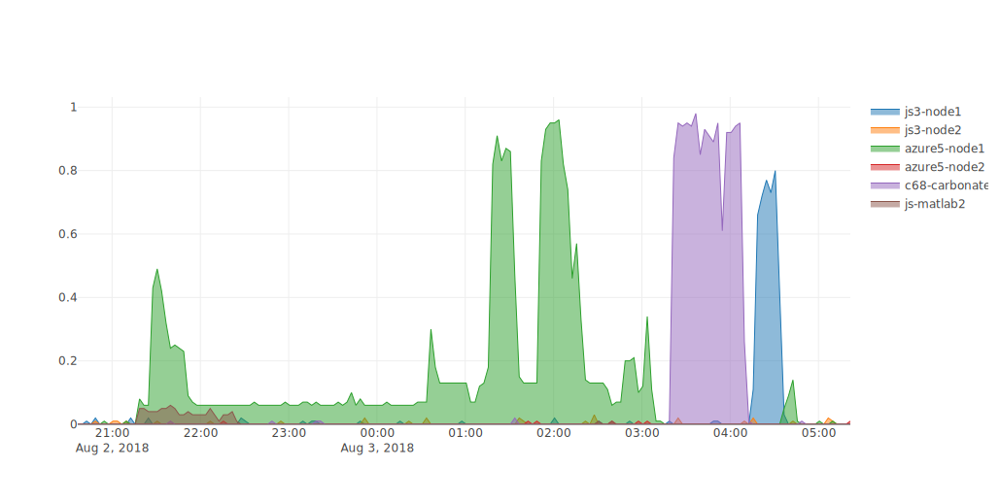

# grafana2plotly

Convert grafana csv output to plotly.js so that you can customize the graph to death. plotly also allows svg export!  

# Run

$ ./convert.js testdata/export1.csv
$ lite-server 

To download the graph in .csv, click the "toImage" button on the toolbar

